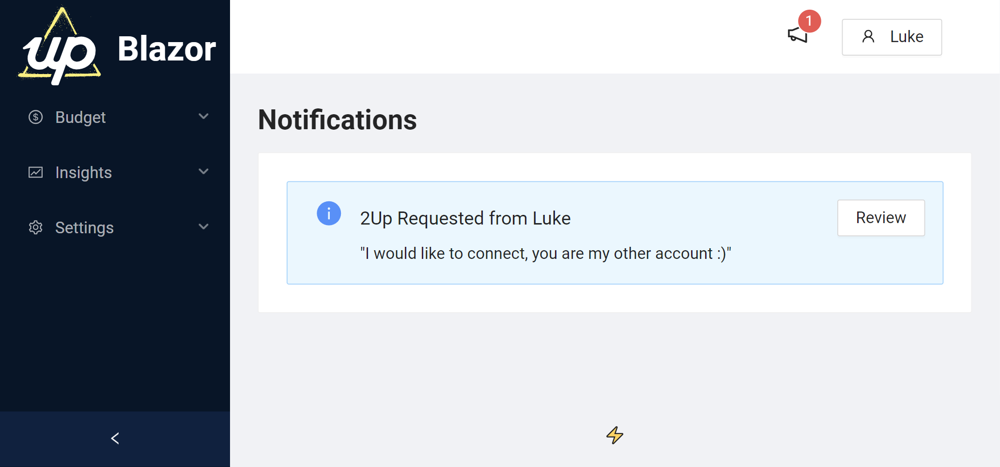
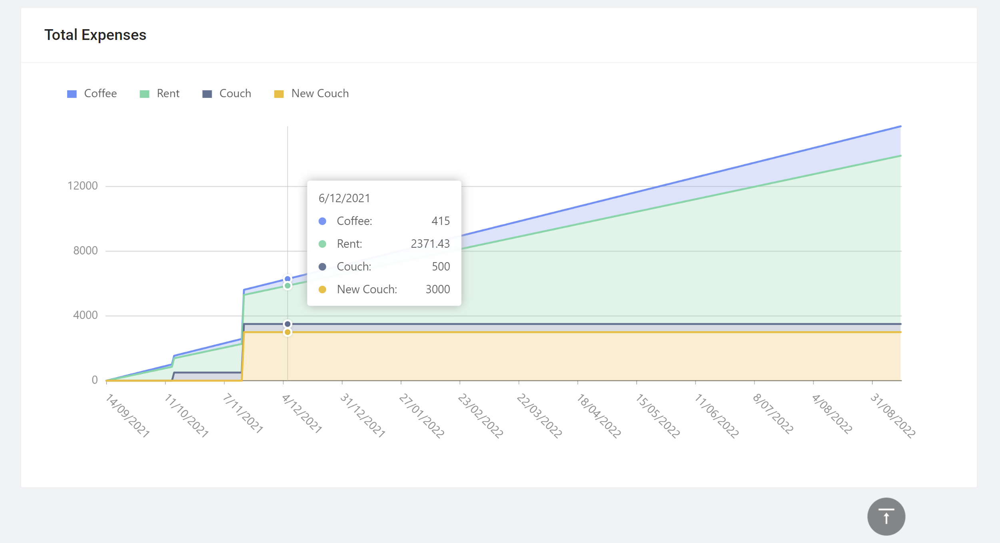
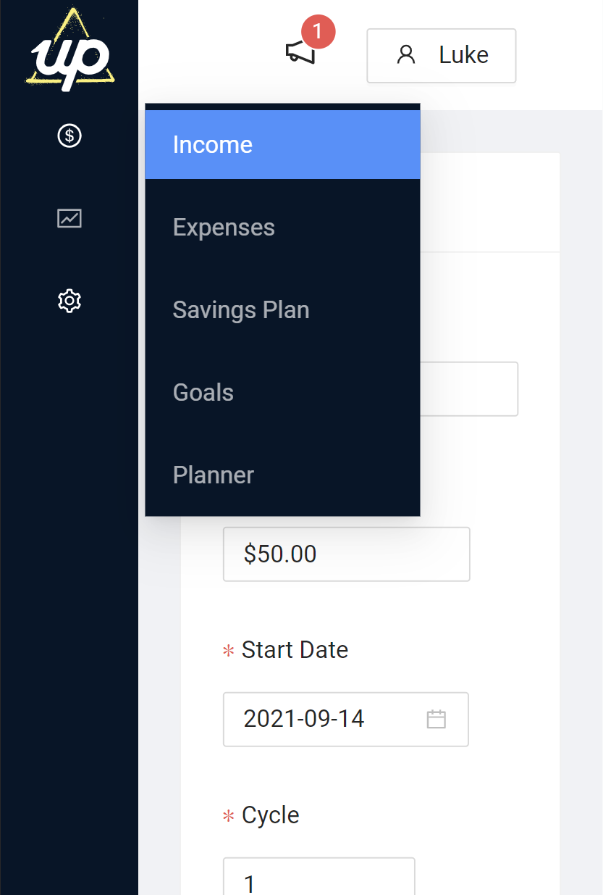
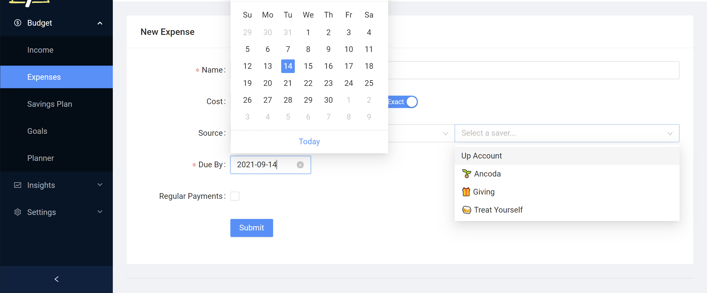
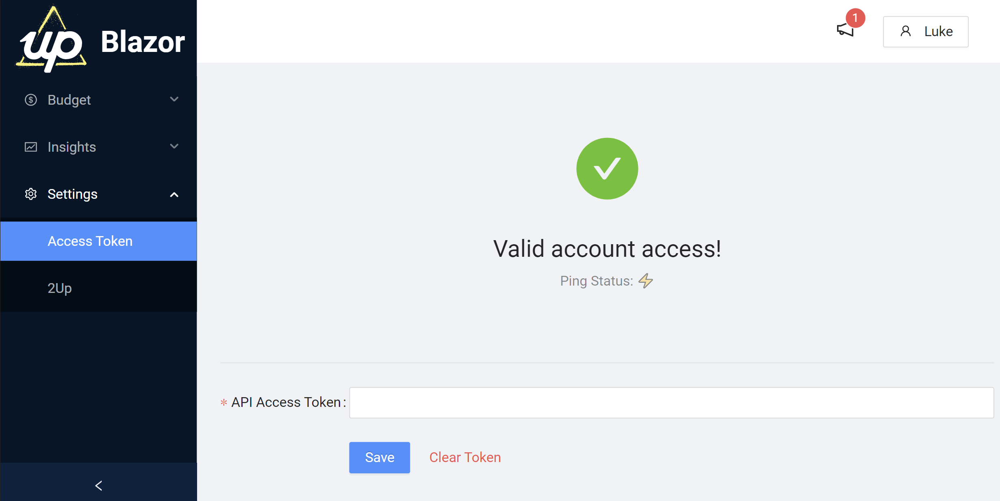
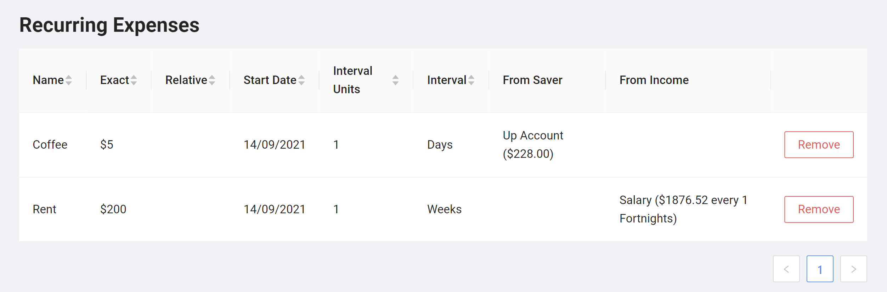

  

  
  

## What is this?

🏦 I built this site to integrate with [Up bank](https://up.com.au) (an Australian digital bank), to assist users with **budgeting** and to gain **powerful future insights**.

### Epics

 - [ ] ⚡ Leverage the [Up API](https://developer.up.com.au) (using [Up.NET](https://github.com/Hona/Up.NET)) to:

     - [x] Fetch existing Transactional and Saver accounts to make selecting which account to save/expense simple
     - [x] Use existing account balances for more accurate insights
     - [ ] Track actual vs intended savings
     - [ ] Automatically set savings in app when created on the site (this API does not exist on Up yet...)
    
 - [x] 💲 Track incomes

     - [x] Exact ($)
     - [x] Allow multiple

 - [x] 🧾 Track expenses
 
     - [x] Exact ($) or Relative (%) cost
     - [x] Source from Income streams/Up accounts
     - [x] One off + Recurring

 - [x] 🪣 Create savings plans
 
     - [x] Create multiple, per income
     - [x] Exact ($) or Relative (%) cost
     - [x] Choose which Saver account to put the amount into

 - [ ] 📈 Insights + analytics

     - [x] Show a breakdown of how the calculations work (relative -> absolute), rolling totals, etc
     - [ ] Forecast graphs

        - [x] Income (in each Up account) - account for all income streams
        - [x] Expenses (aggregate recurring and one offs)
        - [ ] Net Balances (Income - Expenses, in each account)

     - [ ] Suggested Budgetting
     - [ ] Daily Breakdown
     - [ ] Actual vs Intended
     - [ ] Reports
     

     
## Examples

#### Layout + Notifications

#### Graph

#### Responsive Sider

#### Form

#### Result

#### Table

## Code Architecture

This project follows a simplistic take on Clean Architecture.

#### UpBlazor.Core

* Contains the core models that are stored in the database/not dependent on anything
* Repository interfaces to abstract the infrastructure layer
* Helper methods/extensions
* Services

#### UpBlazor.Infrastructure

* Contains repository implementations using [Marten DB](https://martendb.io/)

#### UpBlazor.Web

* Frontend is Blazor server-side
* Authentication is using Microsoft OAuth2
* UI Framework is AntBlazor, with AntBlazor Charts (based on G2Plot)

## Getting Started

### Development

1. Install a local instance of Postgres
2. Create a database called upblazor, and a user with access
3. Update the Marten connection string in appsettings.json
4. Build and run UpBlazor.Web

### Production

1. Install Docker and docker-compose
2. Run `docker-compose up -d --build`
3. The program is exposed on port 9994, so reverse proxy your domain to that port

## Acknowledgments

* [AntBlazor](https://github.com/ant-design-blazor/ant-design-blazor)
* [Up bank](https://up.com.au)

## Contributors

<table>
<tr>
    <td align="center" style="word-wrap: break-word; width: 150.0; height: 150.0">
        <a href=https://github.com/Hona>
            
             
            <b>Luke Parker [SSW]</b>
        </a>
    </td>
    <td align="center" style="word-wrap: break-word; width: 150.0; height: 150.0">
        <a href=https://github.com/anddrzejb>
            
             
            <b>Andrzej Bakun</b>
        </a>
    </td>
</tr>
</table>
